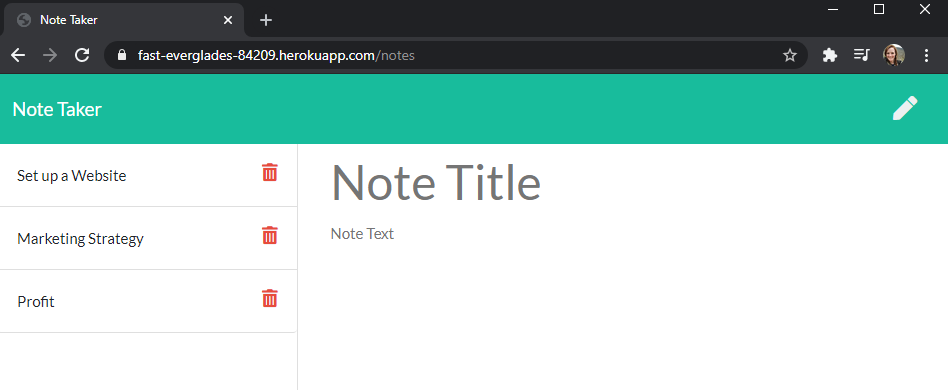

# Note Taker
https://fast-everglades-84209.herokuapp.com/

## Description
Express.js app to keep track of to-dos, take notes, and write yourself reminders.

## Table of Contents

* [Usage](#usage)
* [Extra Features](#extra-features)
* [Known Issues and Future Enhancements](#known-issues-and-future-enhancements)
* [License](#license)

## Usage
To use the app, open it here: https://fast-everglades-84209.herokuapp.com/ and click the "Get Started" button:

You will see existing notes on the left side with room to create a new note on the right side:

After providing a note subject and body, a Save icon becomes available at the top right corner of the page:

After clicking the Save icon, the note you have created is added to the bottom of the list:

As tasks or notes are no longer needed here, you can click the Delete icon to remove that note from the list. In this example, the "Set up a Website" note has been removed:

## Extra Features
Entering any string aside from "notes" in the URL returns the home page:

You can navigate to the JSON view of the note list at .../api/notes. Each object is assigned an ID:

When an item is deleted from the list, the object IDs are updated to reflect their order in the array. In this case, compared to the screenshot above, the "Profit" note was deleted, and the "Retire" note took on the ID of 2:

## Known Issues and Future Enhancements
This section covers known issues with the application, which will be revisited and fixed in a future release.

### Un-Clickable List Items
* This project began with starter code, including the index.js file which renders the page to the browser.
* The code is written so only the text of the note title is clickable, as opposed to clicking anywhere in the row of a given note and having it render on the right.
* This issue is confusing to a user because the cursor becomes a pointer over the entire list item, as opposed to only over the text to help the user know where to click.

### Un-Editable Notes
* After selecting a previously-created note, there is no way to make changes to it - it must be deleted and recreated.

### Inability to Create New Notes
* After selecting a previously-created note, then attempting to write a new note, the right panel locks the user out from further editing and the page must be completely refreshed to create a new note. 

### Missing Hover-Over Text for Icons
* There is no hover-over text to clarify what the icons will do once clicked.

### Inability to Format Text
* When writing the note, there is no rich text editor available to add in bullet points, tables, etc.

## License

MIT License

Copyright (c) 2021 KU Coding Bootcamp

Permission is hereby granted, free of charge, to any person obtaining a copy
of this software and associated documentation files (the "Software"), to deal
in the Software without restriction, including without limitation the rights
to use, copy, modify, merge, publish, distribute, sublicense, and/or sell
copies of the Software, and to permit persons to whom the Software is
furnished to do so, subject to the following conditions:

The above copyright notice and this permission notice shall be included in all
copies or substantial portions of the Software.

THE SOFTWARE IS PROVIDED "AS IS", WITHOUT WARRANTY OF ANY KIND, EXPRESS OR
IMPLIED, INCLUDING BUT NOT LIMITED TO THE WARRANTIES OF MERCHANTABILITY,
FITNESS FOR A PARTICULAR PURPOSE AND NONINFRINGEMENT. IN NO EVENT SHALL THE
AUTHORS OR COPYRIGHT HOLDERS BE LIABLE FOR ANY CLAIM, DAMAGES OR OTHER
LIABILITY, WHETHER IN AN ACTION OF CONTRACT, TORT OR OTHERWISE, ARISING FROM,
OUT OF OR IN CONNECTION WITH THE SOFTWARE OR THE USE OR OTHER DEALINGS IN THE
SOFTWARE.

